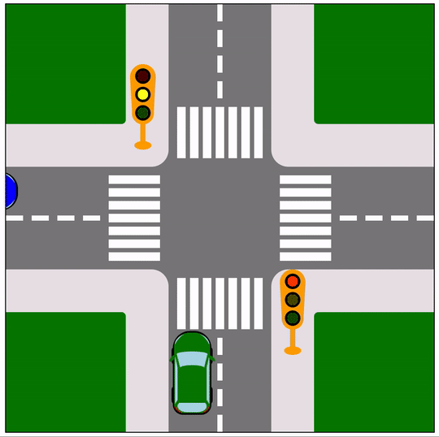

# Traffic Lights Animation

## Objective
Create a traffic lights crossing animation using pure HTML, CSS and JS as well making use of the SVG.js library for the drawings onscreen.

All the elements on the screen were drawn using the library, by command.

## Features
For each new car, its color is randomly generated.

The same goes for the car's behaviour. It can either go straight or make a turn, randomly.

